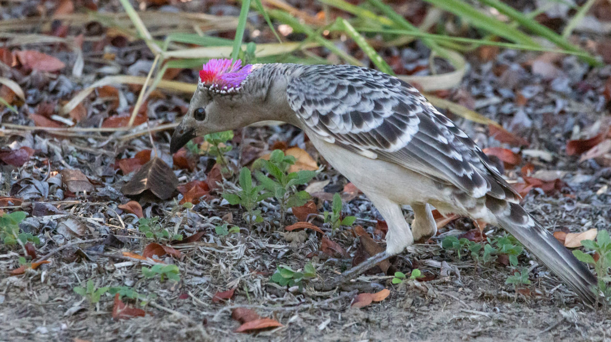
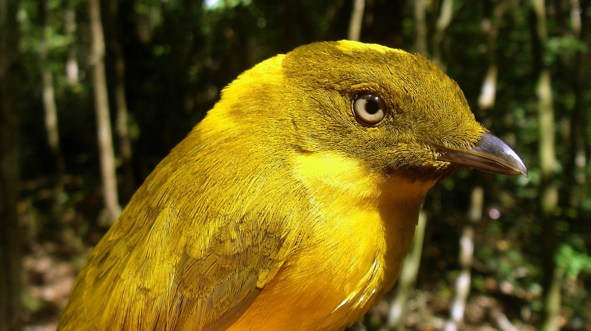

It looked like a tiny shrine on the forest floor: Bare ground clear of debris. Two walls of sticks, bending towards one another. Blue feathers and bottle caps arranged in a wide arc. And a small plastic doll, splayed in the center of the structure, eyes wide and mouth open in a plastic scream.

But this wasn’t the scene of some pagan ritual in miniature. I’d stumbled upon the bower of a satin bowerbird.

Found throughout Australia and New Guinea, bowerbirds are famous for the elaborate and sometimes whimsical structures that males build to court females. These bowers are the largest and most elaborately decorated structure built by any animal — except humans.

## Great Bowerbird, Master of Optical Illusions

Another common Australian species is the great bowerbird, found across the top of Australia. Males and females look very similar, a drab grey-brown, but the males have a hidden crest of neon pink feathers on the top of their heads. Called a nuchal crest, they keep these feathers hidden unless they’re trying to entice a female.

Their bowers are quite similar to the upright stick avenue of the satin bowerbird, but the great bowerbird opts for a display court of grey and white, accented with red, purple, and green objects.

## Tooth-billed Bowerbird, aka The Stagemaker

Tooth-billed bowerbirds are weird, even by bowerbird standards.

They’re found in the small patches of remnant rainforest in far north-eastern Queensland, at altitudes between 500 and 1,500 meters. Males and females are a drab, mottled brown, and even the most eagle-eyed birders are unlikely to see the tiny notches on their bill tip, which gives them their name. These ‘teeth’ are an adaptation for cutting leaves… which brings us to the next odd thing about this species.

Tooth-billed bowerbirds don’t actually build bowers. Instead, they groom the forest floor into a bare display court accented by large, upturned green leaves. Males entice females by singing loudly at the edge of the court. They’re also known to mimic the songs of other species.
