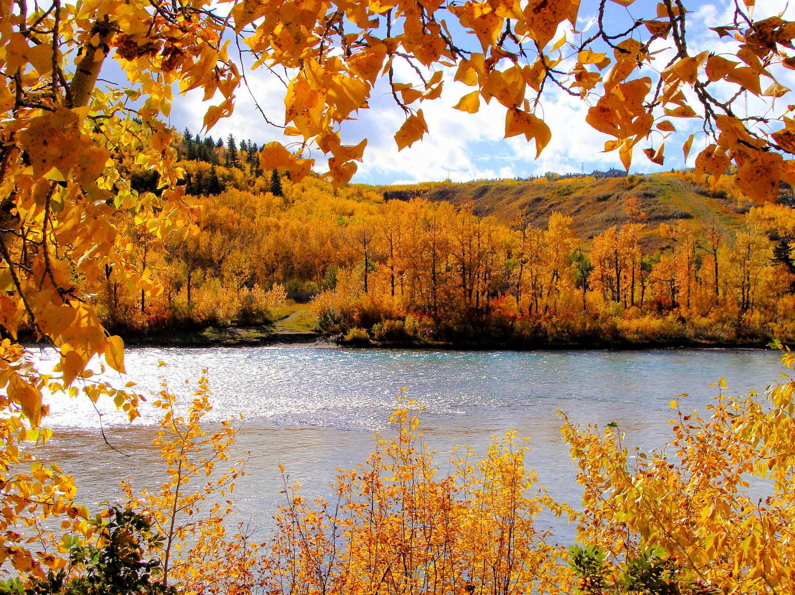
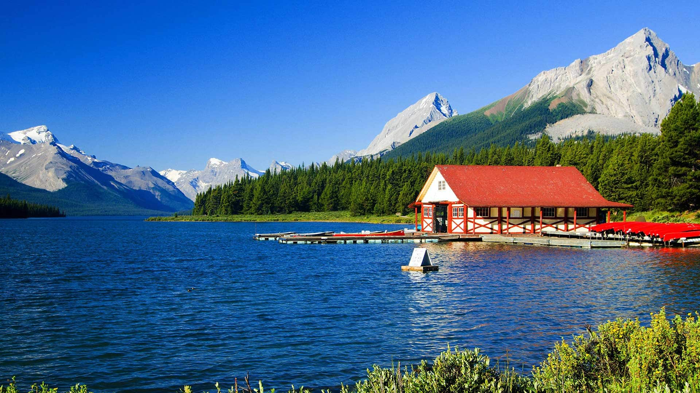

Canada's nature scenery is truly all encompassing- you’ll find mountains, volcanoes, prairies, oceans, rivers, lakes, Arctic tundra’s, glaciers, rain forests, deserts, islands, vineyards, valleys, ravines, cliffs, hills, pastoral land, etc. Most of it is still untouched nature.

Canada is the second largest country in the world in land mass after Russia and it occupies most (41%) of the northern portion of North America. Though the total land mass is close to 10,000,000 sq km, only a small portion of Canada is populated, with the vast majority (85%) of the approximately 33 million people living within 150 km of the southern border it shares with the United States.

That leaves the rest of the country mostly untouched by human development. Just pure Canadian wilderness and abundant nature scenery, filled with wildlife roaming about undisturbed in their own natural habitat... perfect for explorers, adventurers, and nature lovers.

## Topography

Northern Canada’s nature scenery has vegetation tapering from coniferous forests to tundra and finally to Arctic barrens in the far north. The northern Canadian mainland is mostly comprised of the mighty Canadian Shield, an ice-scoured area of Precambrian rocks surrounding Hudson Bay and covering half the country. It's also referred to as the Precambrian Shield, named after the Precambrian Era of 100’s of Millions of years ago. The Canadian Shield expands to 1000’s of square miles of exposed rock, tundra and boreal forest which spans from north of the Great Lakes up to the Arctic Ocean. Known as the only part of North America to have been permanently elevated above sea level, there is an abundance of timber and minerals (ore) available throughout.

## Bodies of Water

Aside from mountain ranges and prairies, western Canada's nature scenery includes large bodies of water, such as the large Lake Winnipeg, the mighty Fraser River, the Saskatchewan river (which drains into Lake Winnipeg), and the Mackenzie River. The latter is the longest river in Canada at 1,738 km, flowing from Great Slave Lake in the Northwest Territories and emptying into the Arctic Ocean.

Canada's vast and diverse geography expands from the Pacific Ocean to the west, the Atlantic Ocean to the east, and the Arctic Ocean to the north, with the United States on its southern border. From sea to sea to sea, and within its borders, there is plenty of nature scenery to be seen in this beautiful country.
