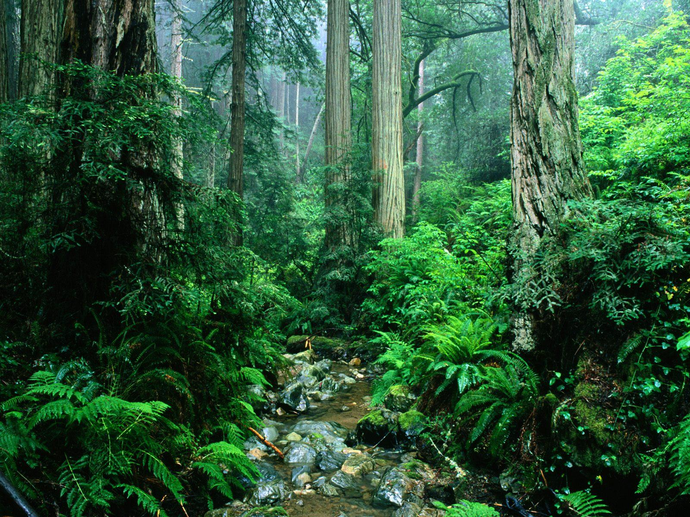
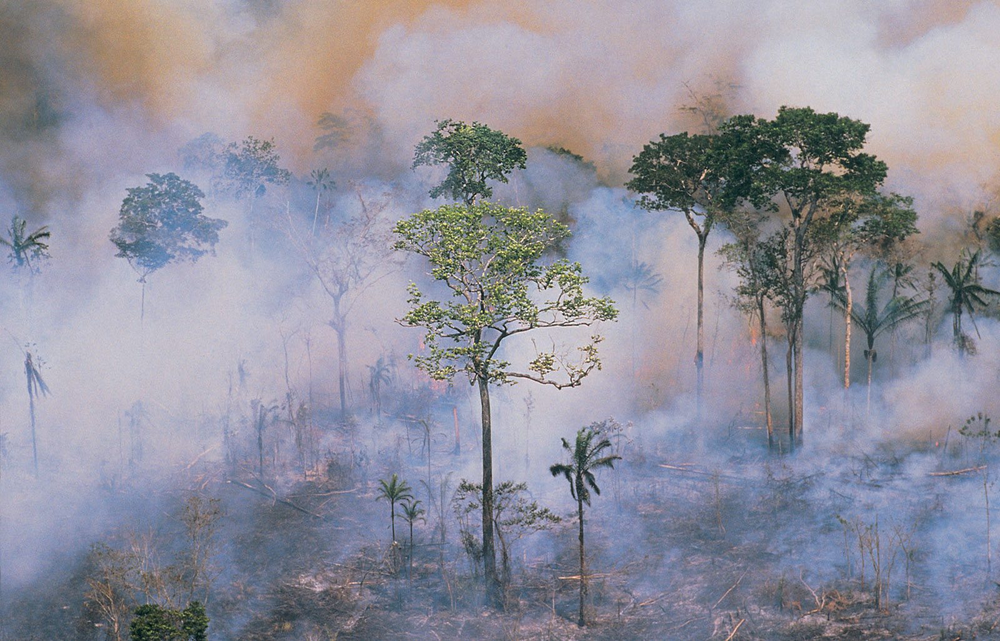

Tropical rainforest, also spelled tropical rain forest, luxuriant forest found in wet tropical uplands and lowlands around the Equator. Tropical rainforests, which worldwide make up one of Earth’s largest biomes (major life zones), are dominated by broad-leaved trees that form a dense upper canopy (layer of foliage) and contain a diverse array of vegetation and other life. Contrary to common thinking, not all tropical rainforests occur in places with high, constant rainfall; for example, in the so-called “dry rainforests” of northeastern Australia, the climate is punctuated by a dry season, which reduces the annual precipitation. This article covers only the richest of rainforests—the tropical rainforests of the ever-wet tropics.

The equatorial latitude of tropical rainforests and tropical deciduous forests keeps day length and mean temperature fairly constant throughout the year. The sun rises daily to a near-vertical position at noon, ensuring a high level of incoming radiant energy at all seasons. Although there is no cold season during which plants experience unfavourable temperatures that prohibit growth, there are many local variations in climate that result from topography, and these variations influence and restrict rainforest distribution within the tropics.

## The Destruction

Not until the past century, however, has widespread destruction of tropical forests occurred. Regrettably, tropical rainforests and tropical deciduous forests are now being destroyed at a rapid rate in order to provide resources such as timber and to create land that can be used for other purposes, such as cattle grazing.

Today tropical forests, more than any other ecosystem, are experiencing habitat alteration and species extinction on a greater scale and at a more rapid pace than at any other time in their history—at least since the major extinction event (the K–T extinction) at the end of the Cretaceous Period, some 66 million years ago.
